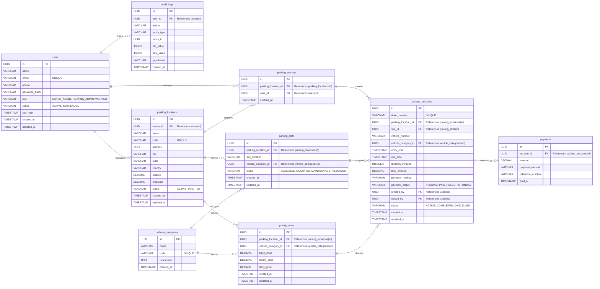

# ParkNova Database Architecture

This document provides a detailed visual layout of the ParkNova database schema, entity relationships, and connections using an Entity-Relationship (ER) diagram.

## Entity-Relationship Diagram

The following Mermaid diagram visualizes all the tables, their columns, and how they connect to one another through primary and foreign keys.

## Detailed Relationship Breakdown

### 1. User Management (`users`)

* The `users` table serves as the central identity and authentication entity for the system.
* Users can have one of three roles: `SUPER_ADMIN`, `PARKING_ADMIN`, or `WORKER`.
* A `PARKING_ADMIN` can manage multiple parking locations.
* Workers are assigned to specific parking locations through the `parking_workers` table.
* All significant system activities performed by users are recorded in the `audit_logs` table.

### 2. Parking Location Management (`parking_locations`)

* `parking_locations` represents individual parking facilities managed within the system.
* Each parking location is owned and managed by a parking administrator.
* A parking location can employ multiple workers.
* Every parking slot and pricing rule is defined within the scope of a specific parking location.
* This entity acts as the operational center for managing parking resources and business rules.

### 3. Vehicle Categories & Pricing (`vehicle_categories`, `pricing_rules`)

* `vehicle_categories` defines the supported vehicle types such as Bike, Car, SUV, or Truck.
* Parking slots are associated with a vehicle category to ensure vehicles are parked in suitable spaces.
* Pricing rules connect a parking location with a vehicle category, allowing different locations to maintain independent pricing structures.
* Each pricing rule defines the base, hourly, and daily charges applicable to a specific vehicle category at a particular location.

### 4. Parking Operations (`parking_workers`, `parking_slots`, `parking_sessions`)

* Workers are responsible for creating and managing parking sessions.
* Parking slots represent the physical parking spaces available at a location and maintain their current occupancy status.
* When a vehicle enters the facility, a parking session is created and linked to a worker, parking slot, pricing rule, and vehicle information.
* Parking sessions store the complete lifecycle of a parked vehicle, including entry time, exit time, duration, total charges, and session status.

### 5. Payments & Billing (`payments`)

* Each completed parking session can generate a corresponding payment record.
* The payments table stores transaction details such as amount paid, payment method, reference number, and payment timestamp.
* This relationship enables revenue tracking and financial reporting for parking operations.

### 6. Audit & Activity Tracking (`audit_logs`)

* The audit logging system provides traceability for all important actions performed within the application.
* Each audit record stores the acting user, affected entity type, entity identifier, and action performed.
* JSON snapshots of previous and updated values are maintained to support historical tracking and operational transparency.
* Audit logs assist with troubleshooting, accountability, and compliance requirements.
