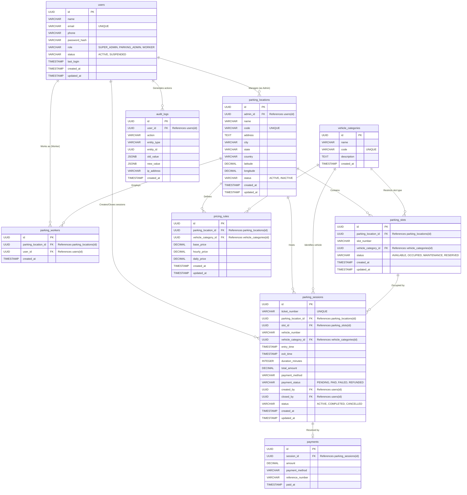

# ParkFlow Database Architecture

This document provides a detailed visual layout of the ParkFlow database schema, entity relationships, and connections using an Entity-Relationship (ER) diagram.

## Entity-Relationship Diagram

The following Mermaid diagram visualizes all the tables, their columns, and how they connect to one another through primary and foreign keys.

## Detailed Relationship Breakdown

1. **Users & Roles (`users`)**
   - **`PARKING_ADMIN`** users map to multiple `parking_locations` where they serve as `admin_id`.
   - **`WORKER`** users are mapped to `parking_locations` via the `parking_workers` junction table.
   - Workers link to `parking_sessions` through `created_by` (check-in) and `closed_by` (check-out).

2. **Location Infrastructure (`parking_locations`)**
   - Acts as the central hub. Every physical asset (slots) and logical rule (pricing, workers) is tied directly to a location ID.
   - Employs a strict cascading delete policy (`ON DELETE CASCADE`) for slots and workers to maintain data integrity if a location is removed.

3. **Categorization & Pricing (`vehicle_categories` & `pricing_rules`)**
   - `vehicle_categories` (e.g., Bike, Car, Truck) act as a global reference.
   - `pricing_rules` creates a unique composite matrix linking a specific `parking_location_id` with a `vehicle_category_id` to determine unique rates (Base, Hourly, Daily) per location.

4. **Live Transactions (`parking_sessions` & `payments`)**
   - The `parking_sessions` table aggregates foreign keys from almost every other domain: It needs a location, a slot, a vehicle category, and workers (creator/closer).
   - Once a session completes (status updates from `ACTIVE` to `COMPLETED`), a row is inserted into the `payments` table mapping directly back to the session.

5. **Security & Auditing (`audit_logs`)**
   - Every major system action records who performed it (`user_id`) along with JSONB snapshots of the `old_value` and `new_value`, allowing complete system state reconstruction if necessary.
